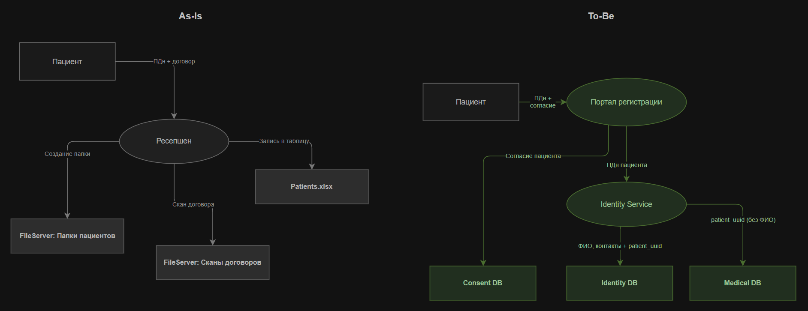
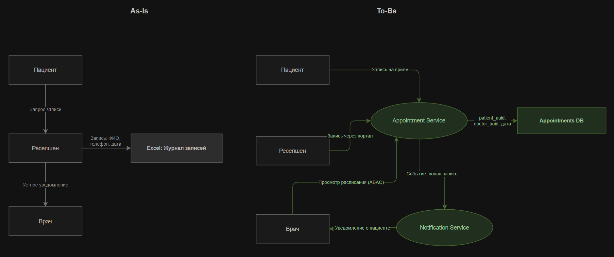
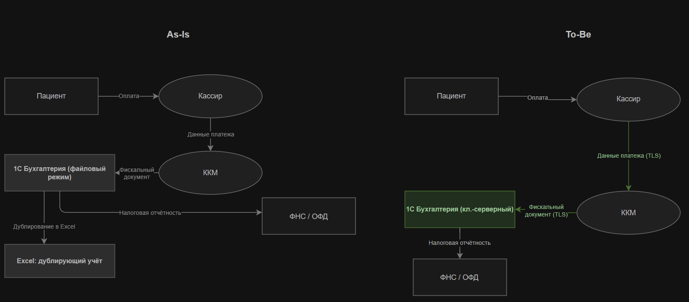
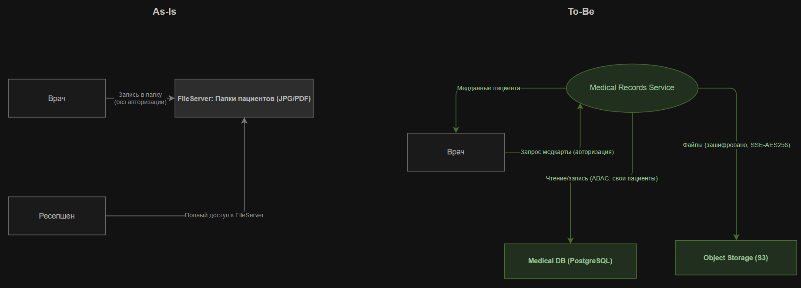
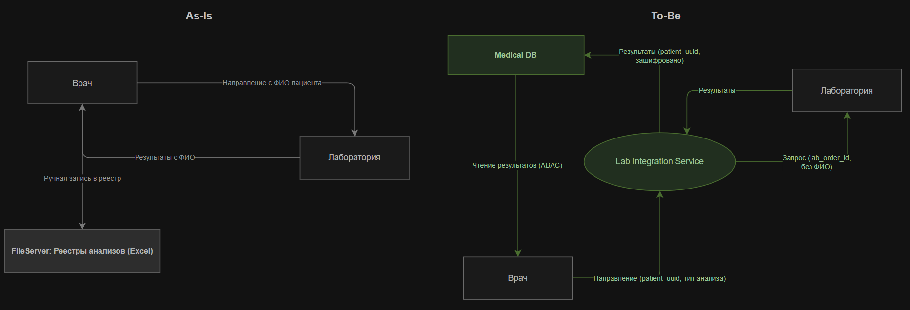

# Проблемные зоны

## Регистрация пациентов

**As-Is:** Регистратура вносит данные пациента в `Patients.xlsx` на файловом сервере; сканы договоров (JPG/PDF) лежат в папке пациента на SMB-шаре.

**Проблемы:**
- ФИО, паспорт, телефон, адрес хранятся в открытом тексте без шифрования
- Любой сотрудник может открыть файл
- Нет фиксации согласия пациента на обработку ПДн
- Нет аудита и неизвестно, кто и когда изменял записи

**To-Be:** Данные принимаются через Портал регистрации. ФИО пациента сразу заменяется на `patient_uuid` (псевдонимизация). Согласие фиксируется в Consent Management Service. Хранение - в зашифрованной PostgreSQL, сканы договоров - в S3.

---

## Запись к врачу

**As-Is:** Журнал записей ведётся в Excel на файловом сервере; доступен всем сотрудникам без ограничений.

**Проблемы:**
- Журнал содержит ФИО пациентов и врачей в открытом виде
- Нет ролевого ограничения: кассир и складской видят расписание всех врачей
- Прямое редактирование файла несколькими пользователями - коллизии данных
- Уведомления пациентам (если есть) не контролируются - риск утечки ПДн через канал рассылки

**To-Be:** Appointment Service с RBAC/ABAC: врач видит только своих пациентов, регистратура - только слот и псевдоним. Notification Service отправляет уведомления без ФИО в payload. Данные хранятся с `patient_uuid`, без ФИО напрямую.

---

## Оплата услуг

**As-Is:** 1С Бухгалтерия работает в файловом режиме; кассиры дублируют данные в Excel; ККМ соединяется с 1С по TCP/IP без шифрования.

**Проблемы:**
- База 1С - обычный файл на сервере; любой пользователь может скопировать всю базу целиком
- Excel-дублирование у кассиров
- Канал ККМ не защищён TLS - данные передаются открытым текстом по локальной сети
- Нет разделения: бухгалтер потенциально видит данные пациентов, кассир - кадровые данные

**To-Be:** 1С использует клиент-серверный режим на PostgreSQL с использованием TLS-соединения. Excel-дублирование исключено. Канал ККМ защищён TLS. Payment Service изолирует финансовые данные, кассир работает с `patient_uuid`, без ФИО.

---

## Ведение медицинских карт

**As-Is:** Врачи и ресепшен обращаются к JPG/PDF-файлам в папках пациентов на общем SMB-шаре. Нет ролевого разграничения.

**Проблемы:**
- Диагнозы, назначения, история болезни хранятся в незашифрованных файлах
- Все имеют потенциальный доступ к медицинским картам
- Нет аудит-лога просмотра карт, невозможно установить, кто открывал файл
- Изменения в документах не отслеживаются

**To-Be:** Medical Records Service хранит структурированные данные в Medical DB и файлы в S3. Врач видит только карты своих пациентов. Все обращения к записям фиксирует Audit Log Service. Регистратура полностью исключена из потока медицинских данных.

---

## Лабораторные анализы

**As-Is:** Направления на анализ - бумажные бланки или вложения по email с ФИО пациента. Результаты возвращаются аналогично. Excel-реестры на файловом сервере содержат ФИО и диагноз.

**Проблемы:**
- ФИО пациента передаётся во внешнюю лабораторию без договора об обработке ПДн
- Email без шифрования для передачи результатов анализов
- ФИО + диагноз в открытом виде, нет разграничения доступа

**To-Be:** Lab Integration Service передаёт в лабораторию только `order_id` без ФИО пациента. Лаборатория работает с только с идентификатором заказа. Результаты принимаются по API с mTLS и сохраняются в Medical DB по `patient_uuid`.

