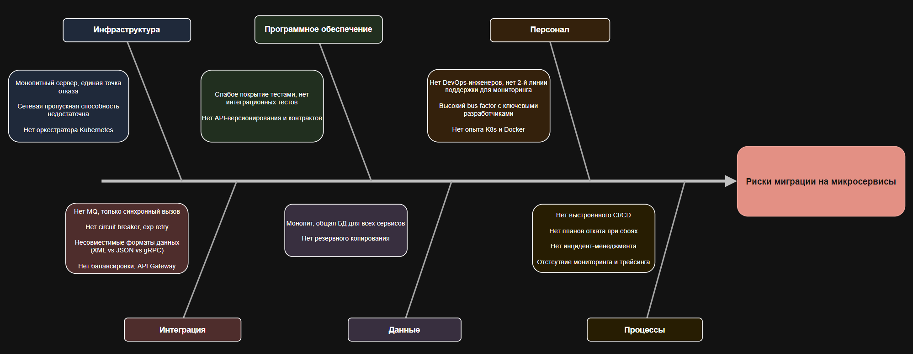

| Категория | Проблема | Решение | Приоритет |
|-----------|----------|---------|-----------|
| **Инфраструктура** | Нет оркестратора Kubernetes | Развернуть Kubernetes до деплоя первого микросервиса, далее постепенно наращивать экспертизу по мере увеличения микросервисов | 0 |
| **Инфраструктура** | Монолитный сервер, единая точка отказа | Несколько нод в Kubernetes | 1 |
| **Инфраструктура** | Сетевая пропускная способность недостаточна | Выделенная внутренняя сеть для сервисов | 3 |
| **Программное обеспечение** | Нет API-версионирования и контрактов | Добавить версионирование | 3 |
| **Программное обеспечение** | Слабое покрытие тестами | TDD для новых сервисов, для новых сервисов покрытие > 40%, для сервисов в проде >60% | 2 |
| **Персонал** | Нет опыта K8s и Docker | Обучение 2–3 инженеров (CKA), найм DevOps/SRE. Постепенно раскатывать инфраструктуру, закладывать больше времени с учетом большего времени на обучение и ошибки | 1 |
| **Персонал** | Высокий bus factor с ключевыми разработчиками | Документирование и передача знаний, код стайл для упрощения чтения кода, усиление код ревью | 2 |
| **Персонал** | Нет DevOps-инженеров, нет 2-й линии поддержки для мониторинга | Найм девопсов, формирование команды поддержки, составление регламентов | 2 |
| **Интеграция** | Нет MQ, только синхронный вызов | Изменение архитектуры, перевод в асинхрон | 0 |
| **Интеграция** | Нет circuit breaker, exp retry | Добавление соответствующих технологий на уровне сервисов или Istio | 3 |
| **Интеграция** | Нет API Gateway, нет балансировки | Добавление Kong, Nginx и т.д. | 2 |
| **Интеграция** | Несовместимые форматы данных (XML vs JSON vs gRPC) | Приведение к одному виду, использование технологий там, где это целесообразно | 3 |
| **Данные** | Монолит, общая БД для всех сервисов | Разделение на отдельные схемы, кластеры, настройка репликаций | 0 |
| **Данные** | Нет резервного копирования | Настройка расписания | 1 |
| **Процессы** | Нет выстроенного CI/CD | Использование и настройка GitLab, прописывание регламентов | 1 |
| **Процессы** | Отстсутвие мониторинга и трейсинга | Настройка базового мониторинга. Настройка полноценного алертинга и трейсинга после найма и обучения команды | 1/2 |
| **Процессы** | Нет планов отката при сбоях | Канареечные релизы, мониторинг healthcheck | 1 |
| **Процессы** | Нет инцидент-менеджмента | Выстраивание процесса работы с постмортемами | 3 |
